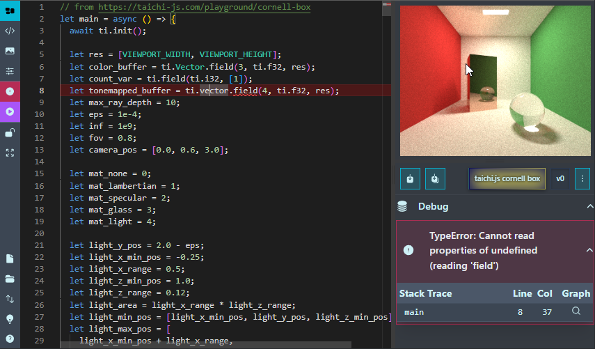

# tinyti editor

An editor for [taichi.js](https://github.com/AmesingFlank/taichi.js/) ([tinyti.js](https://github.com/Sam-Izdat/tinyti.js) fork) – a Javascript implementation of [Taichi Lang](https://www.taichi-lang.org/). The editor was built with [Sveltekit](https://svelte.dev/), [Skeleton UI toolkit](https://www.skeleton.dev/) and [Monaco Editor](https://microsoft.github.io/monaco-editor/).

## [You can find it here.](https://sam-izdat.github.io/tinyti-editor) (WebGPU required)

It can be installed locally with a PWA-capable browser if you want to use it offline. You can also use the github-hosted version to share gists or RAW URLs, or embed them somewhere on the web as an iframe – see the "Import / Export" button on the sidebar for details.

